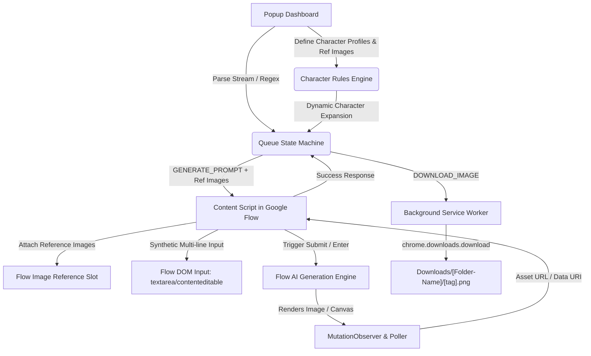

# Framesync-Flow-Automater

An enterprise-grade, production-ready Google Chrome Extension (Manifest V3) designed to integrate directly with an active **Google Flow / Google Labs** tab to automate bulk sequential AI image generation, real-time DOM synchronization, multi-character attribute injection, image reference mapping, and automatic chronological file downloading into custom designated local subfolders.

---

## Architecture & Functional Workflow



### 1. Multi-Character Management & Image Reference Mapping
- **Persistent Character Profiles**: Define character entities (e.g. `Man 01`, `Julian`, `Woman 02`) with locked visual descriptors (clothing, hair, face, physical characteristics).
- **Automatic Character Detection**: The regex engine scans each timestamped prompt in the stream. When a character name is detected (e.g., `... Man 01 sitting in cyber-lounge ...`), it dynamically appends their locked visual attributes:
  ```text
  [Character - Man 01: young adult man, short dark brown hair, slate-blue half-zip pullover, hazel eyes]
  ```
- **Image Reference Upload Slot**: Link local reference character portrait files (`.png`, `.jpg`, `.webp`) in the popup. The content script automatically detects Google Flow's image reference slot and attaches the reference images using synthetic `DataTransfer` file objects.
- **Graceful Fallback**: If an interface does not support direct image upload slots, the system logs a notice and relies on the enriched visual prompt keywords injected directly into the input box.

### 2. High-Fidelity Multi-Line DOM Input
- Multi-line prompts with locked attributes and global art direction are inserted into `textarea` and `contenteditable` elements with native prototype setter bypasses and full synthetic event dispatch (`focus`, `beforeinput`, `input`, `change`).
- Prevents whitespace collapsing or carriage return truncation.

### 3. Bulk Ingestion & Parsing Engine
- **Regex Pattern**:
  ```regex
  /#(\d+-\d+)\s*\n([\s\S]*?)(?=(?:\n#\d+-\d+|$))/g
  ```
- **Global Pre-prompt**: Automatically prepends global styles (e.g., `8k resolution, cinematic lighting, photorealistic`) to every prompt.
- **Chronological File Pipeline**: Formatted strictly as:
  ```text
  Downloads/[Folder-Name]/[tag].png
  ```
  *(e.g., `Episode-01/0-00.png`, `Episode-01/0-03.png`, `Episode-01/0-06.png`)*
- **Duplicate Prevention**: Configured with `conflictAction: "overwrite"` to prevent duplicate filename artifacts like `0-00 (1).png`.

### 4. Resilience, Queue Management & Fault-Tolerance
- **Central State Queue**: Manages states: `Pending`, `Generating`, `Success`, `Failed`.
- **Exponential Backoff**: Timeout (45s) automatically retries up to 2 times with exponential backoff (2s, 4s) before marking as `Failed`.
- **"Retry All Failed"**: Re-dispatches only failed jobs without reprocessing completed items.
- **Storage Persistence**: Character definitions, reference images, folder targets, and prompt streams persist across popup reopens via `chrome.storage.local`.

---

## Directory Layout

```
antigravity-flow-automator/
├── manifest.json              # Manifest V3 config with activeTab, downloads, storage, scripting
├── icons/                     # Extension branding icons (16px, 48px, 128px)
│   ├── icon16.png
│   ├── icon48.png
│   └── icon128.png
├── popup/
│   ├── popup.html             # Dark-mode dashboard with Character Manager, stats & terminal
│   ├── popup.css              # Responsive dark-mode styling with monospace logs
│   └── popup.js               # Regex parser, Character Rules engine, queue dispatcher
├── scripts/
│   ├── content.js             # Flow DOM connector, multi-line input, image upload & MutationObserver
│   └── background.js          # Service worker managing chrome.downloads pipeline
└── README.md                  # Operational documentation
```

---

## Installation & Setup Instructions

1. **Open Google Chrome** and navigate to:
   ```text
   chrome://extensions
   ```
2. **Enable Developer Mode**: Toggle the switch in the top-right corner.
3. Click **"Load unpacked"**.
4. Select the directory:
   ```text
   antigravity-flow-automator
   ```
5. Pin **Antigravity Flow Automator** to your Chrome toolbar.

---

## Operational Guide: Multi-Character Workflow

### 1. Setup Character Rules & Reference Images
1. Click the **Flow Automator** extension icon.
2. In the **Character Rules & Reference Images** section, click **+ Add Character**.
3. Set the character name (e.g. `Man 01`).
4. Enter locked visual attributes:
   ```text
   young adult man, short dark brown hair, slate-blue half-zip pullover, hazel eyes
   ```
5. Click **Link Image** to attach reference character art (e.g. `Man 01.png`).

### 2. Enter Timestamped Bulk Prompts
Enter your continuous prompt stream:

```text
#0-00
Wide shot of Man 01 sitting in cyber-lounge sipping glowing coffee

#0-03
Julian and Man 01 discussing holographic blueprint over metallic table

#0-06
Extreme close-up on Man 01 observing the neon cityscape
```

### 3. Parse & Run
1. Click **Parse Stream**.
2. Click **Start Queue**.
3. Flow Automator will sequentially process all items, detect rendered assets via `MutationObserver`, and download them to `Downloads/[Folder-Name]/[tag].png`.
