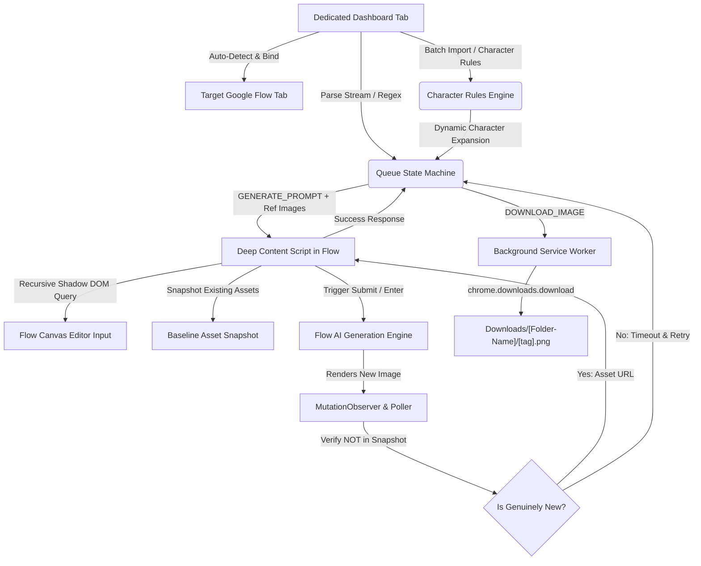

# Framesync-Flow-Automater

An enterprise-grade, production-ready Google Chrome Extension (Manifest V3) designed to integrate directly with an active **Google Flow / Google Labs** tab to automate bulk sequential AI image generation, real-time DOM synchronization, multi-character attribute injection, image reference mapping, and automatic chronological file downloading into custom designated local subfolders.

---

## Architecture & Functional Workflow



### 1. Dedicated Full-Page Dashboard (Never Closes on Tab Switching)
- Clicking the extension icon in Google Chrome launches the **Flow Automator Dashboard** in a dedicated, full-page pinned tab (`popup/popup.html`).
- Because it runs in its own tab, background queue processing is **100% resilient** and will never be aborted or paused when switching tabs or clicking outside.
- Features an active **Target Tab Selector** that scans open tabs, auto-detects your Google Flow tab, and displays real-time connection status (`Flow Canvas Ready` vs `Open Project First`).

### 2. Deep Shadow DOM Selector & Project Canvas Detection
- **Recursive Shadow DOM Traversal**: Google Flow utilizes modern web components with encapsulated Shadow Roots. The content script employs deep recursive querying (`querySelectorDeep` and `querySelectorAllDeep`) across all nested shadow trees to bind to prompt inputs (`textarea`, `contenteditable`, `data-slate-editor`, `role="textbox"`).
- **Home vs Project Detection**: If the active Flow tab is on the home screen (`flow.google.com`) without an open canvas, the automator detects this, attempts to open a new project, or alerts the user in the terminal:
  ```text
  [WARNING] No active Flow Project canvas detected. Please open or create a Flow Project first.
  ```

### 3. Strict Snapshot Image Detection (Zero Wrong or Stale Image Downloads)
- Before submitting each generation, the content script takes a **strict baseline snapshot** of all existing `img` URLs and canvas renders.
- The `MutationObserver` specifically verifies that candidate render URLs were **NOT** present in the initial snapshot, filters out UI avatars and Google icons, and verifies completion (`naturalWidth > 120`).
- If no new render is produced within the timeout window (45s), the system **aborts with a hard timeout instead of grabbing an old image**, allowing the queue manager to trigger an automatic retry with exponential backoff (2s, 4s).

### 4. Multi-Character Management & Batch Reference Images
- **Batch Import**: Click **"Batch Import"** or drag-and-drop multiple character portrait files (`Man 01.png`, `Julian.jpg`, `Woman 02.jpeg`). The engine auto-cleans the filenames into Character Keys and maps their reference portraits.
- **Dynamic Attribute Expansion**: Automatically injects locked visual attributes (hair, outfit, physique) into the prompt when character names are detected, preventing duplicate injection.
- **Reference Image Slot Upload**: Automatically detects Flow's reference image file slot and attaches character portraits via synthetic `DataTransfer` file objects.
- **Chronological Download Pipeline**: Formatted strictly as:
  ```text
  Downloads/[Folder-Name]/[tag].png
  ```
  *(e.g., `Episode-01/0-00.png`, `Episode-01/0-03.png`, `Episode-01/0-06.png`)*
- Configured with `conflictAction: "overwrite"` to prevent duplicate filename artifacts like `0-00 (1).png`.

---

## Installation & Setup Instructions

1. **Open Google Chrome** and navigate to:
   ```text
   chrome://extensions
   ```
2. **Enable Developer Mode**: Toggle the switch in the top-right corner.
3. Click **"Load unpacked"** and select:
   ```text
   antigravity-flow-automator
   ```
4. Click the **Flow Automator** extension icon on your toolbar. It will open the full-page **Dedicated Dashboard**.
5. Open **Google Flow** (`https://flow.google.com`) in another tab and open or create a project canvas.
6. The dashboard will show **⭐ [Google Flow] Flow Canvas Ready**.
7. Paste your prompts, configure characters, and click **Start Queue**.
